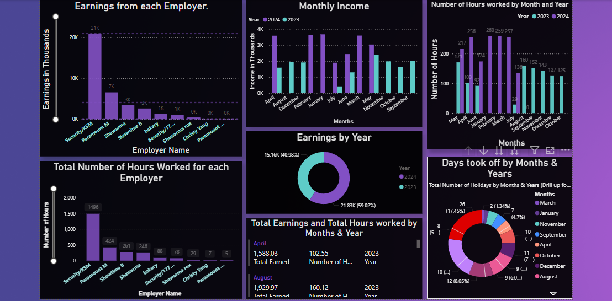

# Work and Income Analysis using Power BI

This repository contains a Power BI dashboard designed to analyze and visualize work and income data across multiple employers. The dashboard provides insights into earnings, hours worked, and days off for each employer over different months and years.

## Dashboard Overview

The Power BI dashboard includes the following visualizations:

1. **Earnings from each Employer**: A bar chart showing the total earnings from each employer.
2. **Monthly Income**: A comparison of monthly income between the years 2023 and 2024.
3. **Number of Hours worked by Month and Year**: A bar chart displaying the number of hours worked each month for the years 2023 and 2024.
4. **Total Number of Hours Worked for each Employer**: A bar chart illustrating the total hours worked for each employer.
5. **Earnings by Year**: A pie chart breaking down the total earnings by year.
6. **Days off by Months & Years**: A donut chart showing the total number of holidays taken each month.
7. **Total Earnings and Total Hours worked by Months & Year**: A table summarizing the total earnings and hours worked by month and year.

## Features

- **Comparative Analysis**: Compare income and work hours across different years and months.
- **Employer Breakdown**: Detailed insights into earnings and hours worked for each employer.
- **Time Off Tracking**: Visualize holidays and days off taken throughout the year.

## How to Use

1. **Clone the Repository**: Clone this repository to your local machine using the following command:
   ```sh
   git clone https://github.com/yourusername/Work-and-Income-Analysis-Power-BI.git
   
2. **Open in Power BI**: Open the .pbix file in Power BI Desktop to explore and interact with the dashboard.


## Requirements

Power BI Desktop


## Screenshots



